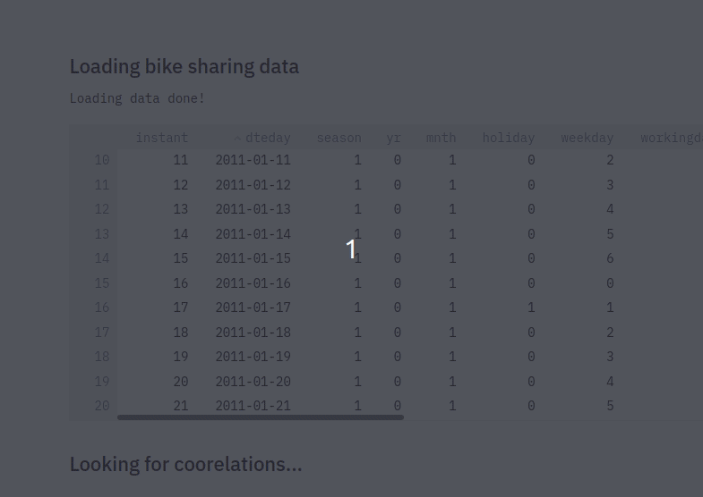
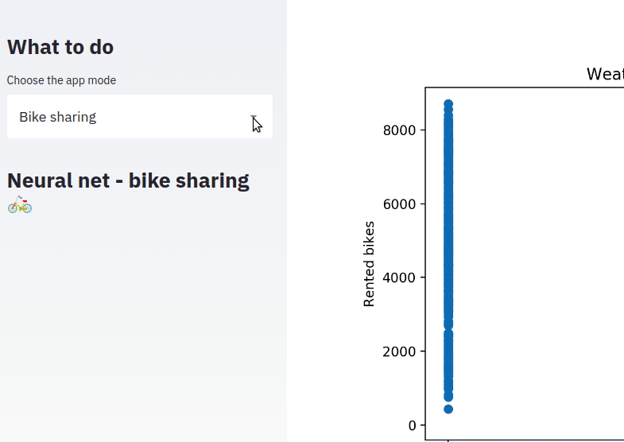

## Working with the UCI Bike Sharing Dataset

The purpose of this repository is myself practice of neural networks. I am a student that is learning, let me know if you find any errors, **the original code is from examples and exercises found in books, tutorials, lectures and other sources all mentioned in this file.** I am just practicing what I have learned, the proper authors and creators of the algorithms/code are the ones mentioned in the file.

I will be using Streamlit to develop an App where I will be sharing what I've learned. To run the app, first clone the repository and install the project dependencies, then run the app with streamlit:


```
pip install -r requirements.txt
streamlit run https://raw.githubusercontent.com/parismollo/BikeSharing-net/master/net.py
```



Resources:
* Lectures: Building a regression model with numpy, Alura: https://www.alura.com.br/curso-online-rede-neural-numpy
* ML glossary: https://ml-cheatsheet.readthedocs.io/en/latest/loss_functions.html
* 3blue1brown: https://www.youtube.com/watch?v=aircAruvnKk&t=551s
* ILOC tutorial: https://www.shanelynn.ie/select-pandas-dataframe-rows-and-columns-using-iloc-loc-and-ix/
